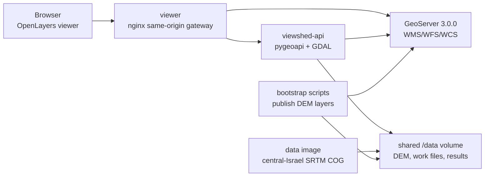

# pygeoapi-viewshed

`pygeoapi-viewshed` is a containerized OGC API - Processes service for running
GDAL viewshed analysis on a DEM, publishing the result to GeoServer, and viewing
the output in a browser-based OpenLayers operator UI.

This repository packages the runtime as three custom images:

- `ghcr.io/ashapira/pygeoapi-viewshed-api:0.1.0`
- `ghcr.io/ashapira/pygeoapi-viewshed-viewer:0.1.0`
- `ghcr.io/ashapira/pygeoapi-viewshed-data:0.1.0`

The stack also uses `docker.osgeo.org/geoserver:3.0.0`.

## Architecture



Services:

| Service | Purpose | Default URL |
| --- | --- | --- |
| `viewer` | OpenLayers UI and nginx proxy to pygeoapi/GeoServer | `http://localhost:8090/` |
| `viewshed-api` | pygeoapi OGC API - Processes endpoint using GDAL | `http://localhost:5000/` |
| `geoserver` | Publishes input DEMs and result layers | `http://localhost:8088/geoserver` |
| `bootstrap-dem` | Creates/publishes offline synthetic DEM | tool profile |
| `bootstrap-srtm` | Downloads or republishes central-Israel SRTM DEM | tool profile |
| `seed-srtm` | Air-gap data-image service that seeds the prepared SRTM COG | air-gap tool profile |

The viewer intentionally has no external basemap. It renders a local neutral map
background, the DEM WMS layer, result WMS/WFS layers, the observer marker, and
the maximum-distance circle.

## Quick Start

Connected development build:

```powershell
cd C:\Alex\work\pygeoapi-viewshed
docker compose up -d --build geoserver viewshed-api viewer
docker compose --profile tools run --rm bootstrap-srtm
```

Open:

- Viewer: `http://localhost:8090/`
- OGC API - Processes: `http://localhost:5000/processes`
- GeoServer: `http://localhost:8088/geoserver`

Synthetic offline DEM fallback:

```powershell
docker compose --profile tools run --rm bootstrap-dem
```

## Air-Gapped Deployment

The air-gapped environment does not build images and does not need internet
access at runtime. Transfer these images with your external image transfer tool:

```text
ghcr.io/ashapira/pygeoapi-viewshed-api:0.1.0
ghcr.io/ashapira/pygeoapi-viewshed-viewer:0.1.0
ghcr.io/ashapira/pygeoapi-viewshed-data:0.1.0
docker.osgeo.org/geoserver:3.0.0
```

The `:latest` tags are also published, but production-like deployments should
pin `0.1.0`.

Run with prebuilt images only:

```powershell
docker compose -f docker-compose.airgap.yml up -d geoserver viewshed-api viewer
docker compose -f docker-compose.airgap.yml --profile tools run --rm seed-srtm
docker compose -f docker-compose.airgap.yml --profile tools run --rm bootstrap-srtm
```

`seed-srtm` copies the prepared COG from the data image into the shared
`/data/dem` volume. `bootstrap-srtm` detects that the COG already exists and
publishes it to GeoServer as `dem:srtm_center_israel` without downloading from
AWS.

## SRTM Data Workflow

The connected bootstrap uses the AWS Open Data Terrain Tiles bucket and Mapzen
Skadi HGT layout:

- Source: `https://s3.amazonaws.com/elevation-tiles-prod/skadi/`
- Tiles: `N31E034`, `N31E035`, `N32E034`, `N32E035`
- Crop bbox: `34.55,31.45,35.65,32.55`
- Output CRS: `EPSG:32636 - WGS 84 / UTM zone 36N`
- Output resolution: `30 m / pixel`
- Output file: `/data/dem/srtm_center_israel_utm36.tif`
- GeoServer layer: `dem:srtm_center_israel`

To prepare the data image input file in a connected environment:

```powershell
.\scripts\Prepare-DataImage.ps1
```

The generated `data-image\srtm_center_israel_utm36.tif` is intentionally ignored
by Git. It is embedded into `pygeoapi-viewshed-data` during image build.

## API Usage

Process endpoint:

```text
POST http://localhost:5000/processes/viewshed/execution
```

Minimal request:

```json
{
  "inputs": {
    "demLayer": "dem:srtm_center_israel",
    "observerX": 703000,
    "observerY": 3497000,
    "observerHeight": 2,
    "targetHeight": 0,
    "maxDistance": 3000,
    "refractionCoefficient": 0.142857,
    "outputType": "both",
    "outputName": "demo_viewshed"
  }
}
```

Inputs:

| Input | Description |
| --- | --- |
| `demLayer` | Allowed DEM layer. Defaults to `dem:srtm_center_israel`; `dem:synthetic_dem` is also supported. |
| `observerX`, `observerY` | Observer coordinate in EPSG:32636 meters. |
| `observerHeight` | Observer height above the DEM, in meters. |
| `targetHeight` | Target height above the DEM, in meters. |
| `maxDistance` | Maximum viewshed radius, capped by `MAX_DISTANCE_METERS` in the API container. |
| `refractionCoefficient` | GDAL curvature/refraction coefficient passed to `gdal_viewshed`. |
| `outputType` | `raster`, `vector`, or `both`. |
| `outputName` | Optional result name prefix. |

Outputs:

- Raster output is published to GeoServer as a WMS/WCS raster layer.
- Vector output is polygonized and published to GeoServer as WMS/WFS.
- Vector polygons include a binary integer field named `Visible`.
- `Visible = 1` means visible; `Visible = 0` means not visible.
- Returned links use the viewer gateway by default:
  `http://localhost:8090/geoserver/...`

## Viewer Usage

Open `http://localhost:8090/`.

The left panel contains DEM layer, read-only DTM metadata, observer coordinates,
observer/target heights, maximum distance, refraction coefficient, output name,
and output type. Clicking the map updates the observer coordinate in EPSG:32636.

Result display:

- Raster results render as a GeoServer WMS overlay.
- Vector results load through WFS GeoJSON and are styled by `Visible`.
- The observer marker and max-distance circle update with the form values.

## Validation

Static checks:

```powershell
python -m py_compile viewshed-api\tools\bootstrap_srtm.py viewshed-api\tools\bootstrap_dem.py viewshed-api\plugins\viewshed_process.py
docker compose config --quiet
docker compose -f docker-compose.airgap.yml config --quiet
cd viewer
npm ci
npm run build
cd ..
```

End-to-end connected checks:

```powershell
powershell -ExecutionPolicy Bypass -File .\validate-viewshed.ps1
powershell -ExecutionPolicy Bypass -File .\validate-srtm-dem.ps1
```

Air-gap compose path check, using already built/local images:

```powershell
powershell -ExecutionPolicy Bypass -File .\validate-airgap.ps1
```

Security check:

```powershell
powershell -ExecutionPolicy Bypass -File .\scripts\Security-Check.ps1
```

The security script runs `npm audit --omit=dev`, both compose config checks,
a runtime external-URL scan for viewer/pygeoapi runtime assets, Docker Scout CVE
reports, and Docker Scout recommendation reports.

## Build And Publish Images

Prepare the data image input once:

```powershell
.\scripts\Prepare-DataImage.ps1
```

Build versioned and `latest` tags:

```powershell
.\scripts\Build-Images.ps1 -Version 0.1.0
```

Push to GHCR:

```powershell
gh auth token | docker login ghcr.io -u AShapira --password-stdin
.\scripts\Push-Images.ps1 -Version 0.1.0
```

## Security Notes

See `SECURITY.md` for the release-time Docker Scout summary and residual
third-party base-image findings.

- The API image uses `ghcr.io/osgeo/gdal:ubuntu-small-3.11.4` because GDAL CLI,
  GDAL Python bindings, and raster/vector conversion tools are required.
- The API image removes unnecessary `curl` and runs as non-root UID/GID `1000`.
- The viewer is built with `node:22.14-alpine` and served by
  `nginxinc/nginx-unprivileged:1.29-alpine`.
- The data image uses `busybox:1.37.0-musl` and only copies the prepared COG.
- GeoServer is consumed as the upstream `docker.osgeo.org/geoserver:3.0.0`
  image and is reported separately in Docker Scout output.
- Runtime operation uses local container networking and same-origin proxy paths.
  No external basemap or CDN is required by the viewer.

## Known Limits

- No authentication proxy or user login is included.
- GeoServer credentials are compose defaults and must be replaced for real use.
- Jobs are synchronous; large DEMs or large radii need an async job model.
- Result lifecycle cleanup is not implemented.
- The allowed DEM list is static.
- The vector output is a direct polygonization of the binary raster result.
- The SRTM workflow is a bootstrap/import path, not a full DEM catalog manager.

## Production Hardening Backlog

- Add secret management for GeoServer credentials.
- Add async process execution and persisted job status.
- Add result retention policy and cleanup API/UI.
- Add DEM catalog selection and metadata discovery.
- Add resource limits, request quotas, and process timeout controls.
- Add signed SBOM/provenance and CI-based vulnerability gates.
- Add TLS termination and an authentication layer.
- Add structured logs and metrics for API, GeoServer publication, and viewer use.
